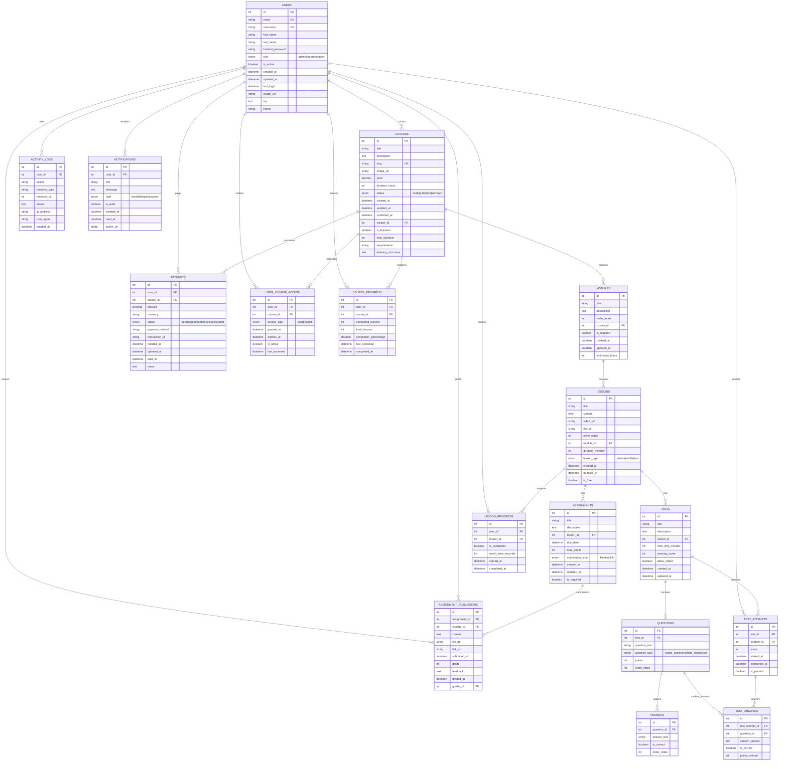

# 🗄️ ER-диаграмма базы данных

## 📊 Структура базы данных

## 🔑 Ключевые особенности

### Индексы для оптимизации:
- `users.email` - уникальный индекс
- `users.username` - уникальный индекс
- `courses.slug` - уникальный индекс
- `user_course_access(user_id, course_id)` - составной индекс
- `activity_logs(user_id, created_at)` - составной индекс
- `payments(user_id, status)` - составной индекс

### Ограничения:
- Каскадное удаление для связанных записей
- Проверка целостности данных
- Ограничения на статусы платежей
- Валидация email и username

### Триггеры:
- Автоматическое обновление `updated_at`
- Подсчет прогресса курса
- Логирование изменений
- Отправка уведомлений

## 📈 Планируемые улучшения

### Партиционирование:
- `activity_logs` по дате
- `payments` по статусу
- `notifications` по типу

### Кэширование:
- Прогресс пользователей
- Популярные курсы
- Статистика активности

### Архивирование:
- Старые логи активности
- Завершенные платежи
- Прочитанные уведомления 